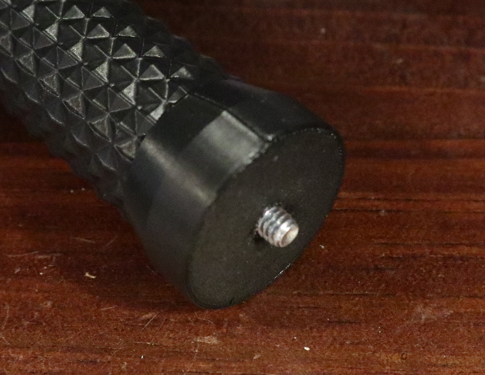

# A monopod handle for your camera

Jenny List 2025
CC-BY-SA 4.0

## About

This is a 3D printed handle for a camera, with a tripod screw at the top and a pointed metal end for greater robustness than a 3D print when resting on a hard surface. I found I needed something a little more than just my mini tripod in the closed position.

## You Will Need:

1. A print of camera-monopod-handle.stl. I printed mine on a Prusa Mini, with a brim, and 40% infil for a little bit of robustness in the field.
2. A 1/4" 20 bolt. Mine are about 50mm or 2" long, with a thread 20mm or 4/5" long.

## To Assemble:

Cut the bolt as shown, with a hacksaw. Discard the hexagonal head, and fole off any burrs.

The threaded part of the bolt should screw into the hole at the top of your print. It's designed such that with a 20mm thread, the required 5mm protrudes to attach to the camera.

Meanwhile the straight piece of the bolt should be an interference fit at the pointed end of the stick. I knocked mine in with some light blows from a small hammer, use a press here if you have one. Then you can grind it to a point. I did this with a bench grinder. The result is bare steel so could corrode, I don't intend to get it wet but I may apply some paint.

I did not use any glue, but if you find your thread or point is loose, you can.

## Licence

This model is licensed under the [Creative Commons Attribution Share Alike 4.0 International licence](license.md).

It uses Stephen Kent's [Knurled Surface Library for OpenSCAD](https://github.com/smkent/knurled-openscad), which is licensed under the Creative Commons CC0 1.0 Universal (Public Domain) License.

